<p align="center">
  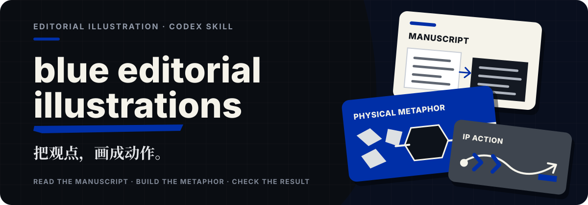
</p>

# 克莱因蓝 IP 插画

把文稿里的判断、关系和状态变化，画成由固定眼镜 IP 亲自完成的动作。不是给旧图换标题，而是为每个观点找到一个能看懂的物理隐喻。

**白底 · 黑色墨线 · 冷灰层次 · 唯一克莱因蓝**。默认中文图内短标注，明确要求时切换英文；输出为 `2048×1152`、`16:9` PNG。

[参考作品](#reference) · [转译逻辑](#method) · [开始使用](#start) · [运行前提](#运行前提) · [下载 v1.0.0](https://github.com/Lee-study154/blue-editorial-illustrations/releases/tag/v1.0.0)

<a name="reference"></a>

## 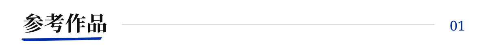

当前收录 **8 张中文 + 2 张英文 reference**。以下是四张代表作品，均为本项目自有生成图。

### 单人：从散页到成稿

IP 把零散材料组织成展示稿；`散页` 与 `成稿` 分别贴近输入和结果。

<p>
  <a href="./blue-editorial-illustrations/assets/examples/01-manuscript-to-presentation.png">
    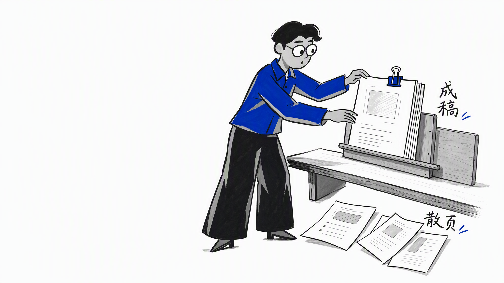
  </a>
</p>

### 双人：让协作产生支撑

两人共同抬起并安装蓝梁，画出“共同承重”与“稳固”的关系。

<p>
  <a href="./blue-editorial-illustrations/assets/examples/02-shared-load.png">
    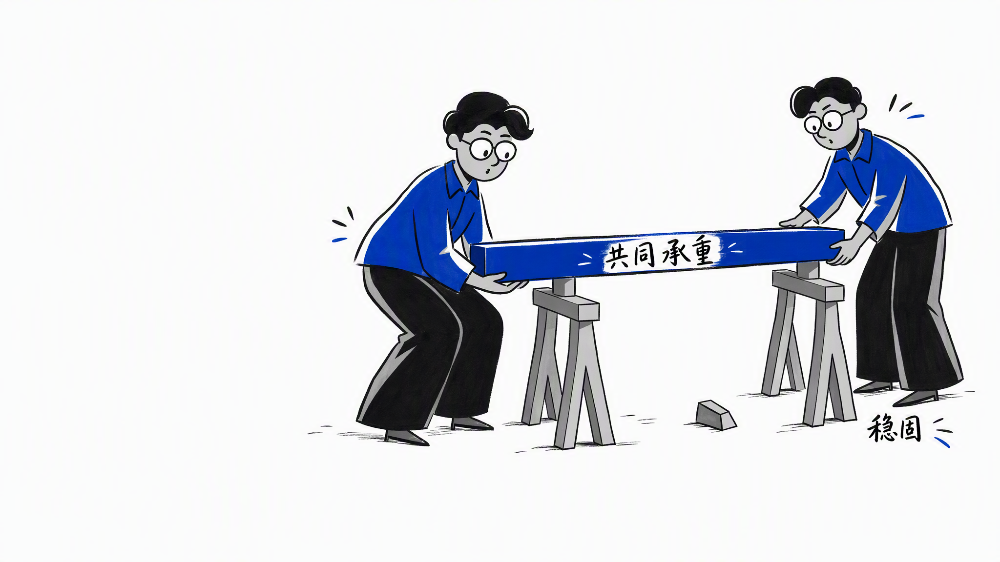
  </a>
</p>

### 多人：把过程放进环境

送料、校准与收取发生在同一个工作台，人物用不同动作解释过程。

<p>
  <a href="./blue-editorial-illustrations/assets/examples/03-workshop-team.png">
    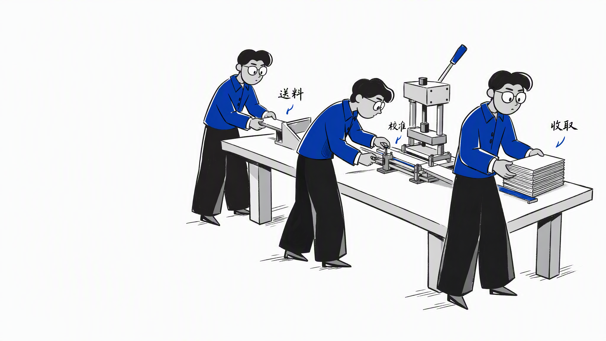
  </a>
</p>

### 英文：文字跟着物件走

英文样例保留原有构图，仅加入贴近物件的短标注：`NOISE`、`INPUT`、`SORT`、`IN ORDER`。它们不是幻灯片大标题，也不改变默认中文输出。

<p>
  <a href="./blue-editorial-illustrations/assets/examples/english-title/01-positioning.png">
    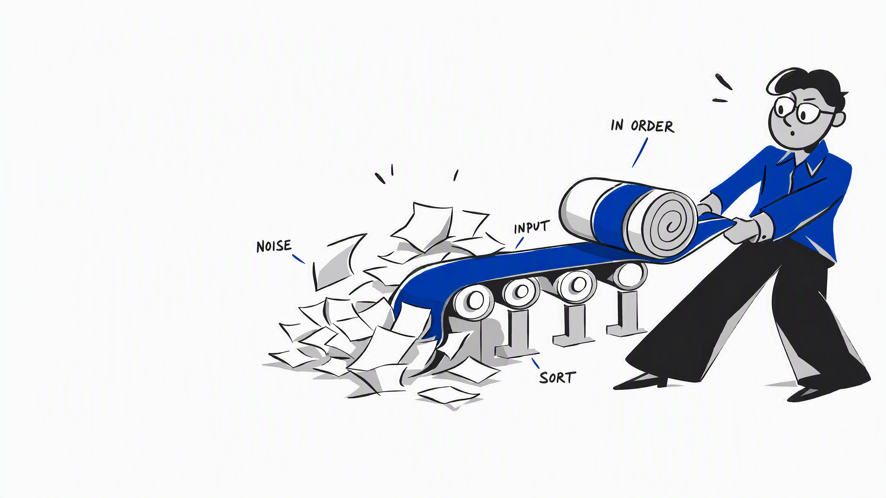
  </a>
</p>

<details>
<summary>展开其余 6 张 reference</summary>

#### 连接修复 · 断点 / 缝合

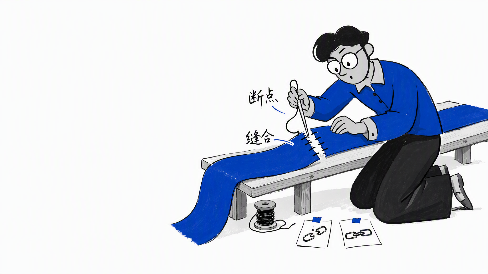

#### 分拣整理 · 杂讯 / 归位

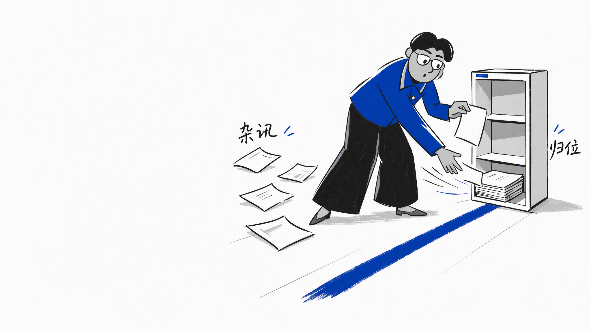

#### 修补交付 · 修补 / 交付

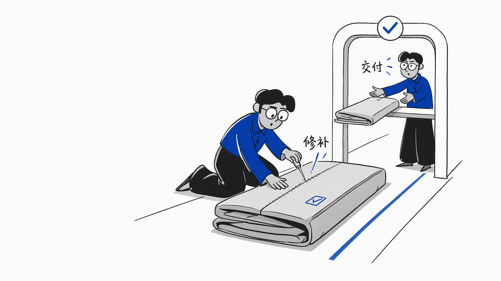

#### 推理判断 · 一步 / 判断

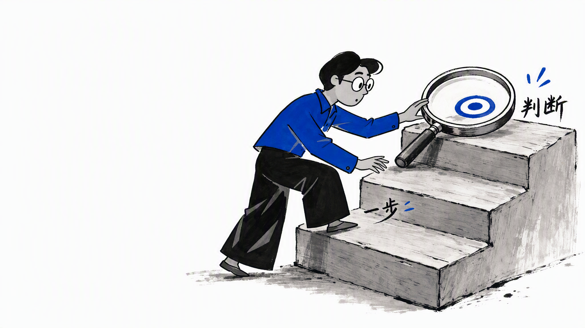

#### 最终校准 · 校准 / 完成

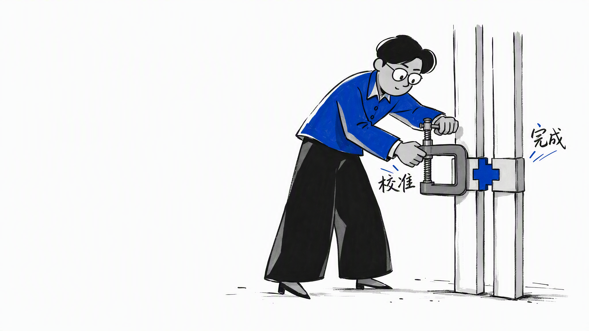

#### 英文文稿整理 · LOOSE PAGES / DRAFT / SORT / DELIVER

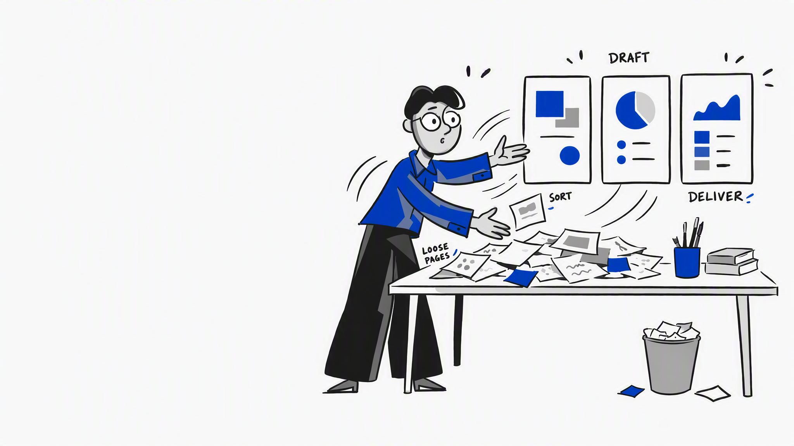

</details>

完整映射见 [Reference Pack](./blue-editorial-illustrations/references/reference-pack.md)；实际提示词分别保存在 [中文 reference](./blue-editorial-illustrations/prompts/final-reference/) 和 [英文 reference](./blue-editorial-illustrations/prompts/english-reference/) 中。示例校准画风和文字行为，不作为新文稿的场景模板。

<a name="method"></a>

## 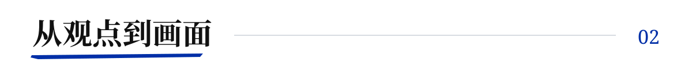

<p>
  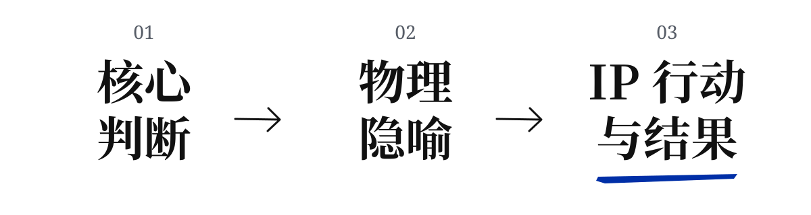
</p>

例如，“把零散信息变成可交付结果”可以画成 IP 整理散页、夹好成稿。动作、物件和结果先解释观点，文字再补充锚点。

1. **挑命题**：从文稿找到值得画的判断和认知转折，不平均配图；单概念只做一张，整篇通常选 4–8 个视觉锚点。
2. **找动作**：先找接、量、筛、托、折等物理动词，再选低科技物件；让 IP 亲自改变状态，而不是站在旁边指讲。
3. **定画面**：在 shot list 中写清位置、隐喻、人数、环境、逐字标注及其物件锚点。每张图只表达一个核心意思。
4. **生成与验收**：每张单独生成，核对 IP、眼睛、腿脚、灰面、空间与文字；有问题就锁定其余区域定向修图。

一个直接的判断标准：**遮掉标注后，画面仍能解释命题；去掉 IP 的动作后，关键转换不应照常发生。**

### 两层文字，各有用途

- **图内短标注**：默认 1–4 个，与动作、物件和结果互动，由生图绘制。中文有手绘笔锋，英文有展示衬线与手写感；错字逐字修正，不用 HTML 叠字冒充。
- **HTML 标题与正文**：保持可编辑的真实文本，放在预留安全区，不遮挡脸、手和主道具。

Skill 提供插画规划、资源与安全区，不是前端框架。HTML 的加载、布局和具体视口仍需执行 agent 单独实现、验收。

<a name="start"></a>

## 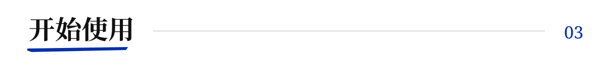

### 安装到 Codex

在 [Releases](https://github.com/Lee-study154/blue-editorial-illustrations/releases/latest) 下载安装 ZIP，解压后将 `blue-editorial-illustrations/` 放入 Codex 的 skills 目录。也可以从仓库安装：

```bash
git clone https://github.com/Lee-study154/blue-editorial-illustrations.git
cd blue-editorial-illustrations
mkdir -p "${CODEX_HOME:-$HOME/.codex}/skills"
cp -R ./blue-editorial-illustrations "${CODEX_HOME:-$HOME/.codex}/skills/"
```

真正安装的是仓库中的同名子目录，不是整个仓库。安装完成后在新对话中调用。

### 第一次调用

```text
Use $blue-editorial-illustrations 为下面这份文稿生成 4 张插画。
默认中文图内短标注，每张对应一个核心观点，预留 HTML 文字安全区。

<文稿>
```

规划无需 API；直接生成需要下方的运行环境与外部传输授权。

<details>
<summary>更多用法：先规划、单概念、英文标注、局部修图与 HTML</summary>

只做规划：

```text
Use $blue-editorial-illustrations 先不要生图。
为这份文稿规划 5 张左右插画，输出位置、核心命题、物理隐喻、IP 动作和逐字图内短标注。
```

单个概念：

```text
Use $blue-editorial-illustrations 为“反馈必须落实到下一轮动作才算闭环”生成一张插画。
```

英文标注：

```text
Use $blue-editorial-illustrations 为这份文稿生成 3 张插画，图内短标注用英文。
```

局部修图：

```text
Use $blue-editorial-illustrations 编辑这张图，只修正指定错字，保持人物、道具、构图和其他文字不变。
```

用于 HTML 演示：

```text
Use $blue-editorial-illustrations 结合这份文稿生成插画并制作 HTML 演示。
图内短标注与动作互动，页面标题和正文保持真实 HTML 文本。
```

</details>

## 运行前提

生图走 **外部 `gpt-image-2` CLI**，本项目已使用 ZenMux `https://zenmux.ai/api/v1`。`imagegen` 只使用其 CLI 程序，不混用 Codex 内置生图服务。

需要运行时提供 imagegen CLI、Python 的 `openai` 依赖、支持编辑接口的 provider 和安全凭证配置。已有本机配置直接复用，IP 由 skill 自动附带，不要求每次手动上传；外部传输仍需明确授权。

仓库不带 CLI 客户端、API key 或私人配置，安装不会自动调用付费 API。新环境按 [CLI 运行环境](./blue-editorial-illustrations/references/generation-runtime.md) 检查；生成结果仍需人工视觉与逐字 QA，留白比例不等于实际 HTML 可用面积保证。

## 文档与检查

- [Skill 入口](./blue-editorial-illustrations/SKILL.md)：模式、工作流与输出边界。
- [风格 DNA](./blue-editorial-illustrations/references/style-dna.md) · [IP 规范](./blue-editorial-illustrations/references/ip-spec.md) · [QA 清单](./blue-editorial-illustrations/references/qa-checklist.md)。
- [构图与隐喻](./blue-editorial-illustrations/references/composition-patterns.md) · [提示词模板](./blue-editorial-illustrations/references/prompt-template.md)。
- [v1.0.0 对标验收](./docs/release-acceptance.md)。

```bash
bash blue-editorial-illustrations/tests/contract.sh
python3 blue-editorial-illustrations/tests/release-contract.py
```

检查覆盖结构、可移植性、凭证模式、图像格式与提示词映射，不代替真实生图、视觉或 HTML 验收。

## 来源与权利

上游改编部分保留 [MIT 归属与原文](./blue-editorial-illustrations/THIRD_PARTY_NOTICES.md)。自有 IP 与图像不自动适用 MIT；公开展示不等于素材开放授权，使用与再发布须取得相应授权。详见 [权利说明](./NOTICE.md)。
